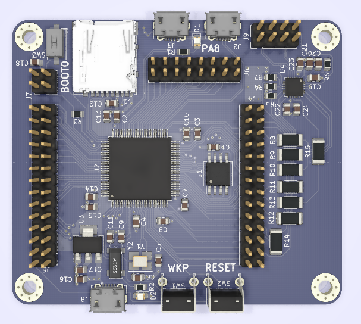
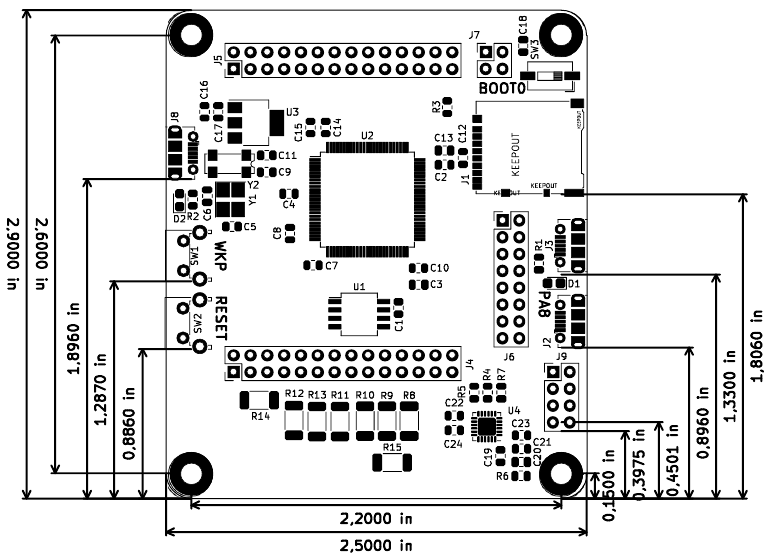
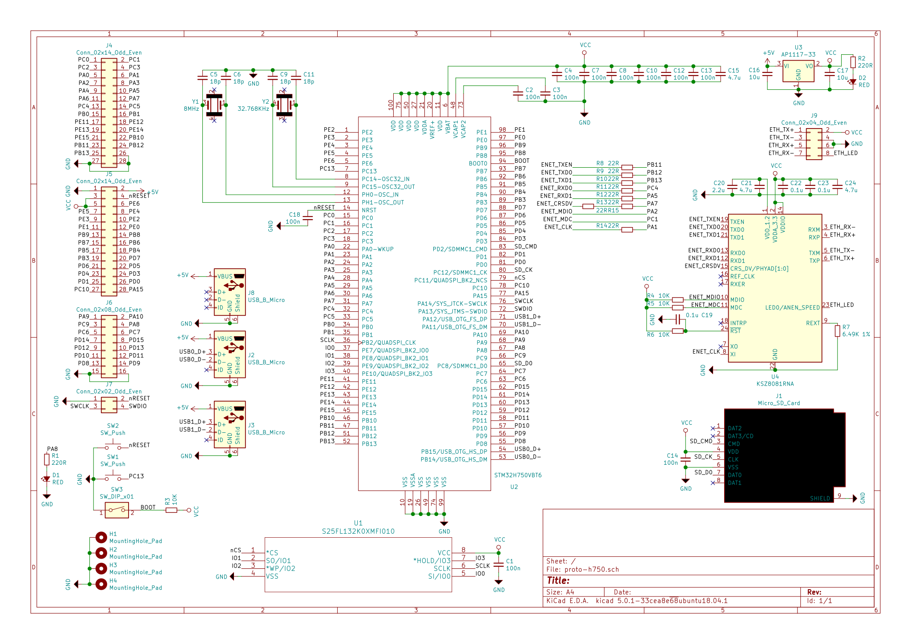

# STM32H7 value line small board

Simple board for stm32h750 value line device in LQFP100 package.

> Require KiCAD 5.0 or higer

#### Design rules:

- Track/Clearance width: 8mils/8mils
- Drill dia: 0.3048 mm
- Via dia: 0.4064 mm

#### Board contents:

- STM32H750VBT6: 1MBy RAM, 128KBy Flash at 400MHz CPU
- External flash in QSPI1 interface with execute in place (4, 8 or 16MBytes)
- USB HS and FS
- Ethernet PHY in RMII interface (optional)
- MicroSD card in 1bit interface
- 8MHz main crystal
- 32.768KHz RTC crystal
- SWD connector
- Reset button
- User button connected to PA13-WakeUP
- User led connected to PA8
- BOOT dip switch
- 800mA 3.3v regulator
- Others GPIO connected to 100mils-space pin header

#### Dimensions:

#### Schematics:

#### BOM and Gerbers

- [ ] BOM: TODO
- [ ] Gerber: TODO
